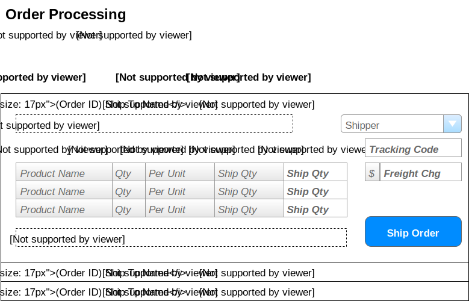

# Order Processing

> Orders are shipped directly from our suppliers to our customers. As such, suppliers log onto our system to see what orders there are for the products that they provide.

## User Interface

Suppliers will be interacting with a page that shows the following information.



The information shown here will be displayed in a **ListView**, using the *SelectedItemTemplate* as the part that shows the details for a given order.

### Events and Interactions


 - **Page_Load** event
 -  - supplier/Contact names obtained from who the logged-in user is.
 -  - Load the ListView data
    - **` List<OutstandingOrder>OrderProcessingController.LoadOrders(SupplierID) `**
 -  - Load the list if shippers
    - **` List<ShipperSelection>OrderProcessingController.LoadShippers() `**

 - **EditCommand** click event
 - Default EditCommand behaviour of the ListView
 - `<EditItemTemplate>` will display the extended info of the Products List  and other order info.

 - **ShipOrder** click 
 - Use a customer command name of "ShipOrder" and handle in the ListView's ItemCommand event. 
 - Gather info from the form for the products to be shipped and the shipping info. This is sent to the **`void OrderProcessing.ShipOrder(int orderID, ShippingDirections, shipping, List<ProductShipment> products)`**

## POCOs/DTO's

The POCOs/DTOs are simply classes that will hold our data when we are performing queries or issuing commands to the BLL


### Queries

```csharp
public class OrderProductInformation 
{
    public int ProductID {get;set;}
    public string ProductName {get;set;}
    public short Qty {get;set;}
    public string QtyPerUnit {get;set;}
    public short Outstanding {get;set;}
    // Note: Outstanding <= OrderDetails.Quantity - sum (ManifestItem.ShipQuantity) for that product/order
}

````

### Commands
Order.Shipped --> BLL
DateTime --> DB


## BLL Processing
