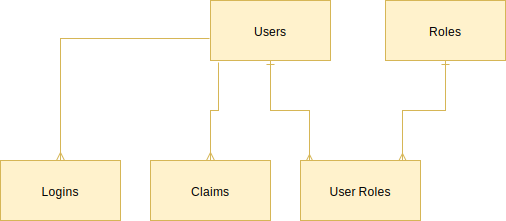
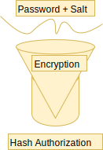

# Notes

**Date: October 29th, 2019**

## Shaving the Yack

https://www.techopedia.com/definition/15511/yak-shaving

<b>Distingish Between Authentication 
&nbsp;&nbsp;&nbsp;&nbsp;&nbsp;&nbsp;and Authorization</b>

- Authentication - Are you who you say you are?
    - Windows Authentication
    - Forms Authentication
        - ASP.NET Identity
    - OAuth Open Authentication
        - 3rd Party
        - JWT - JSON Web Token
- Authorization - what are youable to do/access?
    - Always application Specific
    - Assigning Users to Roles 
    

**- Search Troy Hunt on Youtube for more info on Security**

<b>List Common Authentication 
&nbsp;&nbsp;&nbsp;&nbsp;&nbsp;&nbsp;approaches</b>

<b>Describe the parts of  
&nbsp;&nbsp;&nbsp;&nbsp;&nbsp;&nbsp;ASP.NET Identiy 
&nbsp;&nbsp;&nbsp;&nbsp;&nbsp;&nbsp;(With EF)</b>

<b>Configure a web app to 
&nbsp;&nbsp;&nbsp;&nbsp;&nbsp;&nbsp;use ASP.NET Identity</b>
- Application DbContaxt 
    - DAL
- User/Role Entities 
    - Entities
- UserManager / RoleManager 
    - BLL 
    

Open Visual Studio -> ASP.NET Web Application (.NET Framework) C# -> Webforms -> Authentication - change -> individual user accounts -> Create -> Properties -) in the project url take the s out of https -> save -> okay -> Click WebApp -> right click -> manage nuget packages ->update all nuget packages but bootstrap and AspNet.ScriptManager.bootstrap -> update -> agree -> restart -> open up sql management studio and create database -> edit the connection string in the Web.Config in visual studio to something like **connectionString="Data Source=.;Initial Catalog=Demo;Integrated Security=True" providerName="System.Data.SqlClient"**/> -> Ctrl F5 -> try and login -> open sql again -> view ->  Object Explorer Details -> highlight new tables -> delete

<b>Customize your web app's identity 
&nbsp;&nbsp;&nbsp;&nbsp;&nbsp;&nbsp;configuration</b>

